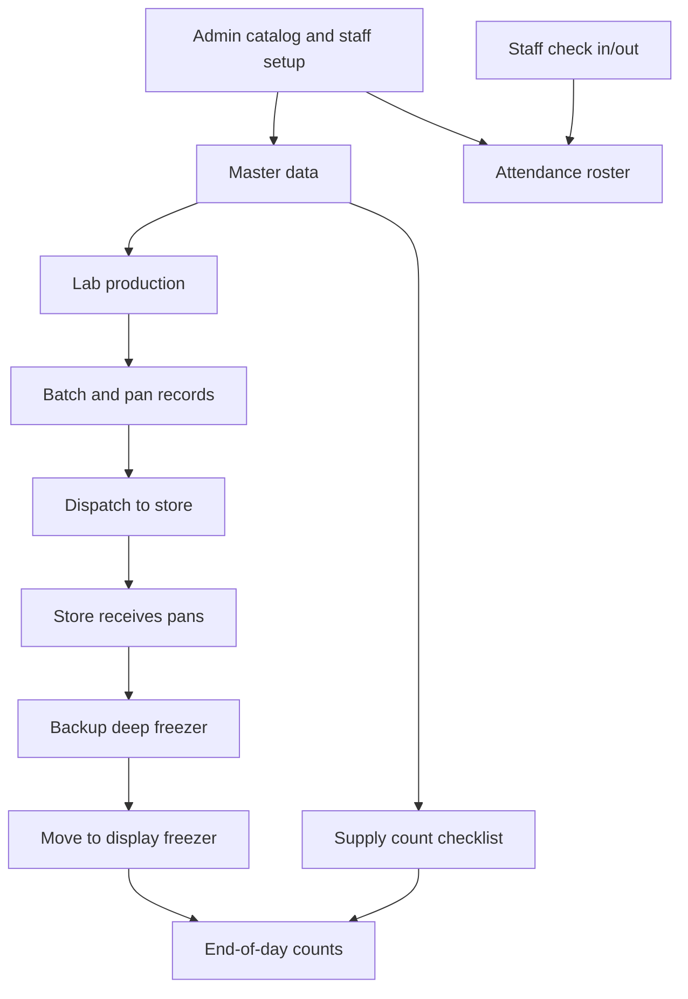
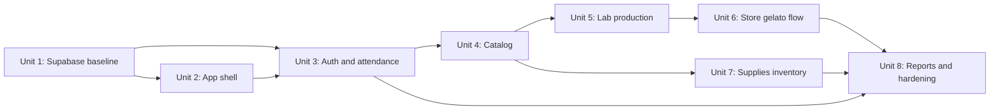

# feat: Build Operations-First MVP

## Summary

Build Snowy Owl Gelato Operations as a mobile-first browser app backed by Supabase. The MVP replaces the current hardcoded single-file prototype with a structured application where Admin can manage all master data from day one, Lab can record production and dispatches, Store staff can receive pans and submit end-of-day inventory, and attendance is captured daily.

The plan keeps POS/QueueBuster integration out of MVP implementation, while leaving the backend clean enough to add POS CSV reconciliation later.

## Origin And Scope

Origin requirements:
- `docs/brainstorms/2026-05-21-operations-first-mvp-requirements.md`
- `index.html`
- `01_Store_Staff_Training.docx`
- `02_Lab_Staff_Training.docx`
- `03_Store_Manager_Training.docx`
- `04_Admin_Training.docx`

The manuals remain the source of truth for persona workflows. The current `index.html` is a prototype and seed-data reference, not the target architecture.

## Requirements Covered

- Admin can edit all master data from day one: flavours, products, categories, raw materials, lab supplies, store supplies, packaging, stores, users, staff settings, and holiday allowances.
- Staff cannot create catalog items.
- Catalog items can be scoped to `lab`, `store`, or `both`; actual inventory is still tracked separately per location.
- Lab can record gelato production by batch/pan, assign pan IDs, track raw materials and lab supplies, and dispatch pans to stores.
- Store staff can accept incoming dispatches, record pan movement from backup to display, and submit end-of-day display freezer weights.
- When a pan is moved to display, staff must answer full or partial; partial requires weight.
- Store supply counts are checklist-driven from the Admin catalog.
- Attendance is MVP: staff check in/out daily; Admin can add/subtract staff, add bonus days, and control allowed holidays.
- Store Manager can correct same-day store submissions.
- Admin can correct historical data frictionlessly in MVP.
- `panRole` stays as an accepted concept: `store`, `backup`, `display`, `event`.
- Browser-based mobile/PWA remains the preferred delivery model.
- QueueBuster credentials must never be committed or exposed in frontend code.

## Out Of Scope For MVP

- QueueBuster/POS sync automation.
- POS sales reconciliation UI.
- Events workflow.
- Morning gelato inventory verification.
- Immutable audit trail and correction reason workflow.
- Native iOS/Android app.
- Advanced analytics or AI recommendations.

## Current Code Findings

The current app is a single `index.html` with:

- Hardcoded demo data in a global `DB` object.
- Hardcoded Supabase URL and anon key in frontend JavaScript.
- Partial Supabase helper functions that are not yet a complete data layer.
- Manual role/persona sections for Admin, Lab, Store Staff, Store Manager, and Events.
- Missing function implementations called by the UI, including `addRecv`, `prefillStoreSup`, `saveStoreSup`, and `fulfilReq`.
- Store supply UI currently allows adding items from store view, which conflicts with the MVP decision that only Admin can create catalog items.

Implication: the implementation should not keep extending the global-script prototype. It should migrate the prototype into a structured app and use the current hardcoded lists only as seed data.

## Technical Direction

Use:

- Vite + React + TypeScript for a maintainable mobile web app.
- Supabase Auth for login/session management.
- Supabase Postgres for catalog, inventory, attendance, dispatch, and correction data.
- Supabase Row Level Security for backend enforcement.
- Supabase migrations and seed files for repeatable database setup.
- Vitest/React Testing Library for unit and component tests.
- Playwright for the main mobile workflow tests.

Frontend environment variables:

- `VITE_SUPABASE_URL`
- `VITE_SUPABASE_ANON_KEY`

Backend/service secrets:

- Stored only in Supabase project secrets or local `.env` files ignored by Git.
- Reserved for later QueueBuster/POS work.

## Data Model Direction

Master data:

- `locations`
- `users`
- `staff_profiles`
- `roles`
- `flavours`
- `catalog_categories`
- `catalog_items`
- `products`
- `product_components`
- `raw_materials`
- `supplies`
- `holiday_policies`

Operational data:

- `gelato_batches`
- `pans`
- `pan_events`
- `dispatches`
- `dispatch_items`
- `store_receipts`
- `display_movements`
- `end_of_day_counts`
- `end_of_day_count_items`
- `inventory_adjustments`
- `attendance_entries`
- `attendance_adjustments`

Deferred POS data:

- `pos_import_batches`
- `pos_sales_staging`
- `pos_reconciliation_runs`

Do not build the deferred POS tables unless they are cheap placeholders with no active UI dependency. The MVP should not depend on POS.

## System Flow

## Implementation Units

### Unit 1: Supabase Intake And Database Baseline

Goal: Inspect the existing Supabase project, then create repeatable local database setup files for the MVP.

Files:

- `supabase/config.toml`
- `supabase/migrations/202605210001_operations_mvp.sql`
- `supabase/seed.sql`
- `.env.example`
- `.gitignore`
- `docs/supabase-setup.md`
- `tests/db/schema.test.ts`

Work:

- Inspect the existing Supabase project before writing final migrations.
- Move current frontend Supabase config into environment variables.
- Define tables for master data, gelato operations, supplies, dispatches, attendance, and corrections.
- Add seed data from current `index.html` lists.
- Add RLS policies aligned to Admin, Lab, Store Staff, and Store Manager roles.
- Document local setup and remote deployment steps.

Tests:

- `tests/db/schema.test.ts` verifies required tables exist.
- Seed verification confirms starting flavours, stores, catalog categories, and staff-role records load correctly.
- RLS verification checks staff cannot create catalog items and Admin can.

Dependencies:

- Requires Supabase project access from user.

### Unit 2: App Scaffold And Mobile Shell

Goal: Replace the single-file prototype with a structured browser app while preserving the key persona navigation.

Files:

- `package.json`
- `package-lock.json`
- `index.html`
- `src/main.tsx`
- `src/app/App.tsx`
- `src/app/routes.tsx`
- `src/app/layout/MobileShell.tsx`
- `src/app/layout/RoleNav.tsx`
- `src/styles/global.css`
- `src/lib/supabase.ts`
- `src/test/render.tsx`
- `vitest.config.ts`

Work:

- Create the Vite React TypeScript app structure.
- Build a mobile-first shell with role-based navigation.
- Keep page density practical for phone use.
- Remove hardcoded global `DB` as application state.
- Keep seed values only in database seed files.

Tests:

- `src/app/layout/MobileShell.test.tsx` verifies navigation renders correctly on small screens.
- `src/app/routes.test.tsx` verifies each persona route is reachable for the right role.

Dependencies:

- Can start after Unit 1 schema names are stable enough for client types.

### Unit 3: Auth, Roles, Staff, And Attendance

Goal: Implement login, staff roster management, and daily attendance.

Files:

- `src/features/auth/AuthProvider.tsx`
- `src/features/auth/LoginPage.tsx`
- `src/features/auth/RequireRole.tsx`
- `src/features/admin/staff/StaffPage.tsx`
- `src/features/admin/staff/staffApi.ts`
- `src/features/attendance/AttendancePage.tsx`
- `src/features/attendance/attendanceApi.ts`
- `src/domain/roles.ts`
- `src/domain/attendance.ts`
- `src/features/attendance/AttendancePage.test.tsx`
- `src/features/admin/staff/StaffPage.test.tsx`

Work:

- Implement Supabase Auth login.
- Map authenticated users to app roles and locations.
- Let Admin add/remove staff, assign role/location, set allowed holidays, and add bonus days.
- Let staff check in and check out from mobile.
- Show Admin an attendance roster view.

Tests:

- Staff can check in and check out once per day.
- Admin can edit holiday allowance and bonus days.
- Store Staff cannot access Admin staff controls.

Dependencies:

- Unit 1, Unit 2.

### Unit 4: Admin Catalog And Master Data

Goal: Build the editable master data system that removes hardcoded flavours and inventory items from the frontend.

Files:

- `src/features/catalog/CatalogPage.tsx`
- `src/features/catalog/CatalogCategoryEditor.tsx`
- `src/features/catalog/CatalogItemEditor.tsx`
- `src/features/catalog/FlavourEditor.tsx`
- `src/features/catalog/ProductEditor.tsx`
- `src/features/catalog/catalogApi.ts`
- `src/domain/catalog.ts`
- `src/domain/flavours.ts`
- `src/features/catalog/CatalogPage.test.tsx`

Work:

- Admin can add/edit/deactivate categories and items.
- Admin can add/edit/deactivate flavours.
- Admin can assign location scope: lab, store, or both.
- Admin can manage products sold and inventory-related items.
- Store/Lab views read catalog items but cannot create them.
- Preserve flavour short code field for pan ID generation.

Tests:

- Admin can create a new flavour and it appears in Lab production selectors.
- Admin can create a store supply and it appears in Store supply checklist.
- Store Staff cannot create or edit catalog items.
- Deactivated catalog items stop appearing in new forms without deleting historical records.

Dependencies:

- Unit 1, Unit 2, Unit 3.

### Unit 5: Lab Production, Pan IDs, And Dispatch

Goal: Implement lab-side gelato production and dispatch flow.

Files:

- `src/features/lab/LabDashboard.tsx`
- `src/features/lab/ProductionForm.tsx`
- `src/features/lab/PanList.tsx`
- `src/features/lab/DispatchForm.tsx`
- `src/features/lab/labApi.ts`
- `src/domain/pans.ts`
- `src/domain/dispatches.ts`
- `src/features/lab/ProductionForm.test.tsx`
- `src/features/lab/DispatchForm.test.tsx`

Work:

- Lab records production by flavour, quantity, batch date, and pan count.
- Generate simple pan IDs from flavour short code, numeric date, and sequence.
- Record batch ID separately from pan ID.
- Create pan records with initial role/location.
- Dispatch selected pans to a store.
- Track raw material and lab supply usage at a basic inventory level.

Tests:

- Producing three pans for one flavour creates three unique pan IDs.
- Pan IDs include flavour code, date, and sequence.
- Dispatching pans changes their status to in transit.
- Lab cannot dispatch a pan that is already dispatched or closed.

Dependencies:

- Unit 1, Unit 2, Unit 4.

### Unit 6: Store Receiving, Display Movement, And EOD Gelato Counts

Goal: Implement store-side pan intake and end-of-day gelato inventory.

Files:

- `src/features/store/StoreDashboard.tsx`
- `src/features/store/IncomingDispatches.tsx`
- `src/features/store/DisplayMovementForm.tsx`
- `src/features/store/EodGelatoCount.tsx`
- `src/features/store/storeApi.ts`
- `src/domain/inventory.ts`
- `src/features/store/IncomingDispatches.test.tsx`
- `src/features/store/DisplayMovementForm.test.tsx`
- `src/features/store/EodGelatoCount.test.tsx`
- `tests/e2e/store-gelato-flow.spec.ts`

Work:

- Store staff accept incoming dispatches.
- Accepted pans become backup inventory for that store.
- Staff can move a backup pan to display.
- Display movement requires pan ID and full/partial choice.
- Partial display movement requires weight.
- End-of-day count records weights for display pans.
- Store Manager can correct same-day store submissions.
- Admin can correct historical store inventory records.

Tests:

- Store receives dispatched pan and it appears in backup inventory.
- Display movement blocks submit if partial is selected without weight.
- End-of-day count records only display freezer pans.
- Store Manager can correct same-day count.
- Store Staff cannot correct another store's records.
- E2E mobile flow: Lab creates pan -> dispatches -> Store receives -> moves partial pan to display -> submits EOD count.

Dependencies:

- Unit 1, Unit 2, Unit 3, Unit 4, Unit 5.

### Unit 7: Supplies And Raw Material Inventory

Goal: Implement catalog-driven supply and raw-material counting for stores and lab.

Files:

- `src/features/inventory/InventoryChecklist.tsx`
- `src/features/inventory/InventoryCountPage.tsx`
- `src/features/inventory/inventoryApi.ts`
- `src/domain/supplies.ts`
- `src/features/inventory/InventoryChecklist.test.tsx`
- `src/features/inventory/InventoryCountPage.test.tsx`

Work:

- Generate store supply count checklist from catalog items scoped to store or both.
- Generate lab raw material and lab supply checklist from catalog items scoped to lab or both.
- Record inventory counts by location and count date.
- Let Admin correct historical inventory counts.
- Prevent staff from adding new inventory items from count screens.

Tests:

- Store supply checklist includes store and both-scoped supplies.
- Lab checklist includes lab and both-scoped raw materials/supplies.
- Staff can submit counts but cannot add catalog items.
- Admin deactivation removes item from future checklists while preserving old count rows.

Dependencies:

- Unit 1, Unit 2, Unit 3, Unit 4.

### Unit 8: Reporting Views, Corrections, And MVP Hardening

Goal: Add the minimum operational visibility and cleanup required for a usable MVP.

Files:

- `src/features/admin/reports/AdminReportsPage.tsx`
- `src/features/admin/corrections/CorrectionsPage.tsx`
- `src/features/admin/corrections/correctionsApi.ts`
- `src/features/store/StoreManagerPage.tsx`
- `src/features/admin/reports/AdminReportsPage.test.tsx`
- `src/features/admin/corrections/CorrectionsPage.test.tsx`
- `tests/e2e/admin-catalog-attendance.spec.ts`
- `tests/e2e/mobile-navigation.spec.ts`
- `README.md`

Work:

- Build Admin views for recent dispatches, EOD counts, supply counts, and attendance.
- Build frictionless correction UI for Admin.
- Build same-day correction UI for Store Manager.
- Verify each persona only sees relevant pages.
- Document how to run the app, connect Supabase, seed data, and test.
- Remove or archive prototype-only code paths.

Tests:

- Admin can correct old EOD inventory.
- Store Manager can correct same-day inventory only.
- Mobile navigation exposes only relevant persona pages.
- Catalog changes flow through to Lab and Store forms.
- Attendance roster appears in Admin reports.

Dependencies:

- Units 1 through 7.

## Dependency Graph

## Implementation Notes

- Keep forms short and mobile-first. Split complex workflows into small steps rather than one long page.
- Prefer scanner-ready pan ID fields later, but MVP can use typed pan IDs.
- Store pan ID and batch ID separately. Pan ID is operational; batch ID supports traceability.
- Use status/event records for pan movement instead of overwriting only the latest state.
- Use soft deactivation for catalog records so historical inventory remains valid.
- Start with simple correction permissions, but store enough metadata to support a later audit trail.
- Avoid writing QueueBuster credentials, service-role keys, or POS secrets into frontend code or Git.

## Open Questions For Implementation

- Supabase remote state: what tables, policies, and functions already exist in the user's project?
- Pan ID collisions: should flavour short codes be manually unique in Admin, auto-suggested, or both?
- Pan weight defaults: what standard full-pan weight should the app use per pan/product type?
- Non-gelato products: which sellable products must be operationally counted on day one?
- Attendance: should check-in location be selected manually or inferred from assigned store for MVP?

These should be answered during implementation when the relevant unit starts.

## Risks

- The current prototype contains incomplete flows; direct patching would likely preserve hidden broken states.
- Supabase setup may already contain partial schema that must be reconciled before migrations are finalized.
- RLS mistakes can silently expose or block data, so database tests are required.
- Mobile usability can degrade quickly if Admin-level data density leaks into staff workflows.
- Pan ID rules must stay simple enough for staff while still being unique enough for accounting.

## Verification Plan

Run, at minimum:

- Database schema/RLS tests.
- Unit tests for catalog, attendance, lab production, dispatch, receiving, display movement, EOD counts, and supply checklists.
- Playwright mobile tests for the core Lab -> Store -> EOD workflow.
- Playwright mobile tests for Admin catalog and attendance workflows.
- Manual smoke test on a phone-sized viewport before declaring MVP complete.

## Sources

- Supabase local development and migrations: https://supabase.com/docs/guides/cli/local-development
- Supabase Row Level Security: https://supabase.com/docs/guides/database/postgres/row-level-security
- Supabase password auth: https://supabase.com/docs/guides/auth/passwords
- Supabase Edge Function secrets: https://supabase.com/docs/guides/functions/secrets
