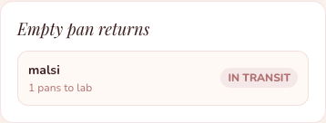
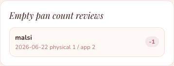

# Admin Pan Guide

Admin reviews pan workflow problems. Admin does not normally move physical pans.

## 1. Review Empty Pan Returns

1. Sign in as **Admin**.
2. Tap **Stores**.
3. Look at **Empty pan returns**.
4. Check store, quantity, and status.

## 2. Review Empty Pan Count Problems

1. Tap **Stores**.
2. Look at **Empty pan count reviews**.
3. Check physical count, app count, and variance.
4. Ask Store Manager what happened.

## 3. What To Ask Store Manager

Ask simple questions:

- How many empty pans are physically in the store?
- Did staff mark a low pan as empty?
- Did any empty pans already leave for lab?
- Did lab accept or dispute the empty pan return?

## Remember

- A mismatch is a review flag, not always a mistake.
- A low pan can be treated as empty in the app.
- Use the app report and the physical count together.

