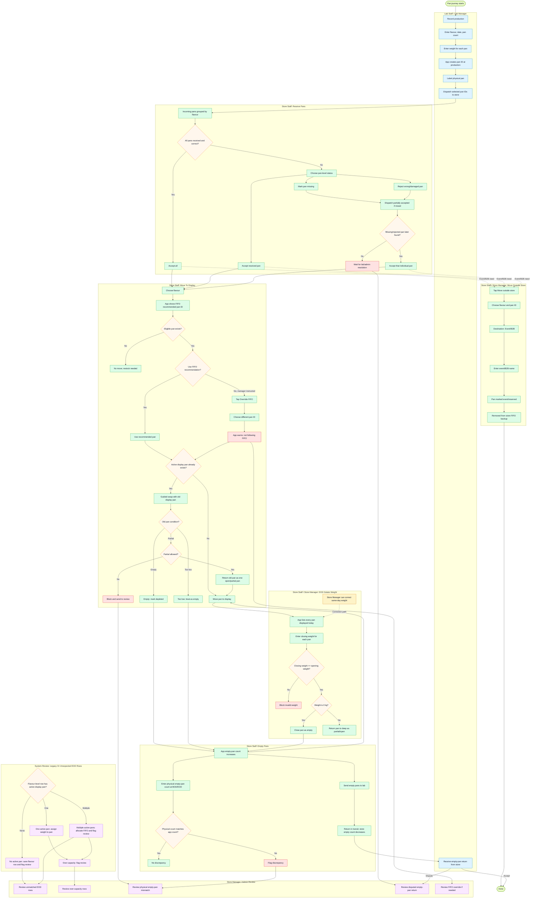

# Pan Workflow Flowchart

This flowchart is for tracking the pan lifecycle features. Staff guides are in separate files in this folder.

```mermaid
flowchart TB
  START([Pan journey starts])

  subgraph LAB["Lab Staff / Lab Manager"]
    direction TB
    L1["Record production"]
    L2["Enter flavour, date, pan count"]
    L3["Enter weight for each pan"]
    L4["App creates pan ID at production"]
    L5["Label physical pan"]
    L6["Dispatch selected pan IDs to store"]
    L7["Receive empty-pan return from store"]
  end

  subgraph STORE_RECEIVE["Store Staff: Receive Pans"]
    direction TB
    R1["Incoming pans grouped by flavour"]
    R2{"All pans received and correct?"}
    R3["Accept all"]
    R4["Choose pan-level status"]
    R5["Accept received pan"]
    R6["Mark pan missing"]
    R7["Reject wrong/damaged pan"]
    R8["Dispatch partially accepted if mixed"]
    R9{"Missing/rejected pan later found?"}
    R10["Accept that individual pan"]
    R11["Wait for lab/admin resolution"]
  end

  subgraph DISPLAY["Store Staff: Move To Display"]
    direction TB
    D1["Choose flavour"]
    D2["App shows FIFO recommended pan ID"]
    D3{"Eligible pan exists?"}
    D4["No move; restock needed"]
    D5{"Use FIFO recommendation?"}
    D6["Use recommended pan"]
    D7["Tap Override FIFO"]
    D8["Choose different pan ID"]
    D9["App warns: not following FIFO"]
    D10{"Active display pan already exists?"}
    D11["Move pan to display"]
    D12["Guided swap with old display pan"]
    D13{"Old pan condition?"}
    D14["Empty: mark depleted"]
    D15["Too low: treat as empty"]
    D16{"Partial allowed?"}
    D17["Return old pan as one open/partial pan"]
    D18["Block and send to review"]
  end

  subgraph OUTSIDE["Store Staff / Store Manager: Move Outside Store"]
    direction TB
    O1["Tap Move outside store"]
    O2["Choose flavour and pan ID"]
    O3["Destination: Event/B2B"]
    O4["Enter event/B2B name"]
    O5["Pan marked event/reserved"]
    O6["Removed from store FIFO backup"]
  end

  subgraph EOD["Store Staff / Store Manager: EOD Gelato Weight"]
    direction TB
    E1["App lists every pan displayed today"]
    E2["Enter closing weight for each pan"]
    E3{"Closing weight <= opening weight?"}
    E4["Block invalid weight"]
    E5{"Weight is 0 kg?"}
    E6["Close pan as empty"]
    E7["Return pan to deep as partial/open"]
    E8["Store Manager can correct same-day weight"]
  end

  subgraph LEGACY_EOD["System Review: Legacy Or Unexpected EOD Rows"]
    direction TB
    X1{"Flavour-level row has active display pan?"}
    X2["No active pan: save flavour row and flag review"]
    X3["One active pan: assign weight to pan"]
    X4["Multiple active pans: allocate FIFO and flag review"]
    X5["Over capacity: flag review"]
  end

  subgraph EMPTY["Store Staff: Empty Pans"]
    direction TB
    P1["App empty-pan count increases"]
    P2["Enter physical empty-pan count at BOD/EOD"]
    P3{"Physical count matches app count?"}
    P4["No discrepancy"]
    P5["Flag discrepancy"]
    P6["Send empty pans to lab"]
    P7["Return in transit; store empty count decreases"]
  end

  subgraph REVIEW["Store Manager / Admin Review"]
    direction TB
    A1["Review unmatched EOD rows"]
    A2["Review over-capacity rows"]
    A3["Review physical empty-pan mismatch"]
    A4["Review disputed empty-pan return"]
    A5["Review FIFO override if needed"]
  end

  START --> L1 --> L2 --> L3 --> L4 --> L5 --> L6 --> R1 --> R2

  R2 -- "Yes" --> R3 --> D1
  R2 -- "No" --> R4
  R4 --> R5 --> D1
  R4 --> R6 --> R8
  R4 --> R7 --> R8
  R8 --> R9
  R9 -- "Yes" --> R10 --> D1
  R9 -- "No" --> R11 --> A4

  R3 -. "Event/B2B need" .-> O1
  R5 -. "Event/B2B need" .-> O1
  R10 -. "Event/B2B need" .-> O1
  O1 --> O2 --> O3 --> O4 --> O5 --> O6 --> END

  D1 --> D2 --> D3
  D3 -- "No" --> D4
  D3 -- "Yes" --> D5
  D5 -- "Yes" --> D6 --> D10
  D5 -- "No, manager instructed" --> D7 --> D8 --> D9 --> A5
  D9 --> D10
  D10 -- "No" --> D11 --> E1
  D10 -- "Yes" --> D12 --> D13
  D13 -- "Empty" --> D14 --> P1
  D13 -- "Too low" --> D15 --> P1
  D13 -- "Partial" --> D16
  D16 -- "Yes" --> D17 --> D11
  D16 -- "No" --> D18 --> A3
  P1 --> D11

  E1 --> E2 --> E3
  E3 -- "No" --> E4
  E3 -- "Yes" --> E5
  E5 -- "Yes" --> E6 --> P1
  E5 -- "No" --> E7
  E8 -. "Correction path" .-> E1

  X1 -- "None" --> X2 --> A1
  X1 -- "One" --> X3
  X1 -- "Multiple" --> X4 --> A1
  X3 --> X5
  X4 --> X5
  X5 --> A2

  P1 --> P2 --> P3
  P3 -- "Yes" --> P4
  P3 -- "No" --> P5 --> A3
  P1 --> P6 --> P7 --> L7
  L7 -- "Accept" --> END([Done])
  L7 -- "Dispute" --> A4

  classDef lab fill:#dff3ff,stroke:#0284c7,color:#0f172a;
  classDef store fill:#dcfce7,stroke:#16a34a,color:#0f172a;
  classDef manager fill:#fef3c7,stroke:#d97706,color:#0f172a;
  classDef admin fill:#fae8ff,stroke:#a855f7,color:#0f172a;
  classDef decision fill:#fff7ed,stroke:#f97316,color:#0f172a;
  classDef warning fill:#fee2e2,stroke:#dc2626,color:#0f172a;
  classDef endNode fill:#ecfccb,stroke:#65a30d,color:#0f172a;

  class L1,L2,L3,L4,L5,L6,L7 lab;
  class R1,R3,R4,R5,R6,R7,R8,R10,D1,D2,D4,D6,D7,D8,D11,D12,D14,D15,D17,O1,O2,O3,O4,O5,O6,E1,E2,E6,E7,P1,P2,P4,P6,P7 store;
  class E8 manager;
  class A1,A2,A3,A4,A5,X2,X3,X4,X5 admin;
  class R2,R9,D3,D5,D10,D13,D16,E3,E5,X1,P3 decision;
  class R11,D9,D18,E4,P5 warning;
  class START,END endNode;
```
