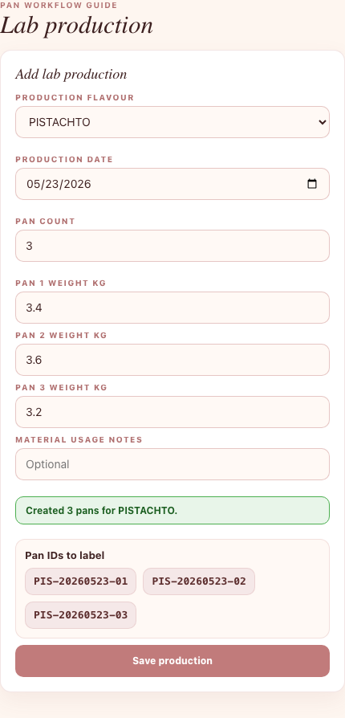
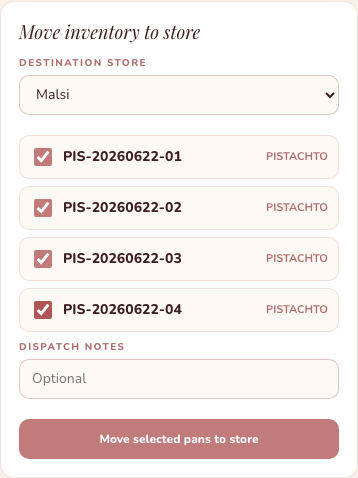
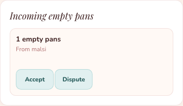

# Lab Staff Pan Guide

Use this guide for lab production, dispatch to store, and receiving empty pans.

## 1. Make New Pans

1. Sign in as **Lab Staff** or **Lab Manager**.
2. Tap **Lab**.
3. In **Add lab production**, choose the flavour.
4. Enter production date.
5. Enter pan count.
6. Enter the weight for each pan in kg.
7. Tap **Save production**.
8. Write the shown **Pan IDs** on the physical pans.

## 2. Send Pans To A Store

1. Go to **Move inventory to store**.
2. Choose the destination store.
3. Tick the pan IDs you are sending.
4. Tap **Move selected pans to store**.

## 3. Receive Empty Pans Back

1. Go to **Incoming empty pans**.
2. Check the store name and number of empty pans.
3. Tap **Accept** if the count is correct.
4. Tap **Dispute** if the count is wrong.

## Remember

- Do not dispatch a pan unless the physical pan is going to that store.
- Each pan can have a different weight.
- Pan IDs must be written clearly on the physical pans.
- If empty pans received from store do not match the app, tap **Dispute**.
