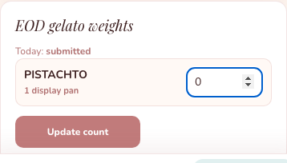

# Store Manager Pan Guide

Store Manager can do store staff work and can correct same-day EOD mistakes.

## 1. Correct EOD Gelato Weight

Use this if staff entered the wrong EOD gelato weight today.

1. Sign in as **Store Manager**.
2. Check in to the store.
3. Tap **Store**.
4. Tap **EOD gelato weights**.
5. Find the pan row.
6. Change the wrong weight.
7. Tap **Update weight**.

If the pan is empty, enter **0**.
Do not enter a weight higher than the **Opening** weight shown by the app.

## 2. Check Empty Pan Mismatch

If the app says there is a mismatch:

1. Count physical empty pans in the store.
2. Check if any low pan was marked empty but still has some gelato.
3. Tell Admin what happened.
4. If needed, add notes when submitting the physical count.

## 3. Help Staff With Missing Or Rejected Pan

If staff marked one pan missing or rejected by mistake:

1. Open **Incoming pans**.
2. Find **Rejected pans**.
3. Find the correct pan ID.
4. Tap **Accept pan** for only that pan.

Only do this if the physical pan is really in the store.

## 4. Send Pan For Event/B2B

Use this when a pan is leaving store backup for an event or B2B order.

1. Sign in as **Store Manager**.
2. Check in to the store.
3. Tap **Store**.
4. Tap **Move outside store**.
5. Choose the flavour and pan ID.
6. Enter the event or B2B name.
7. Tap **Move pan out**.

After this, the pan is not part of store FIFO backup.

## Remember

- Staff can make mistakes. Correct same-day EOD in the app.
- Check physical pans before resolving a mismatch.
- Use **Move outside store** only when the pan is actually leaving for event/B2B.
- If the problem is old or unclear, ask Admin.
