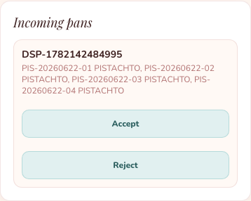
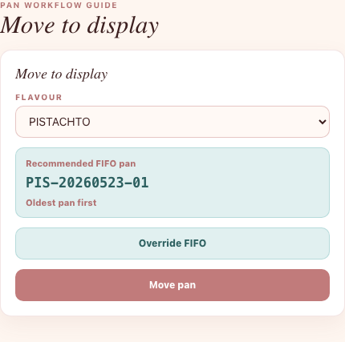
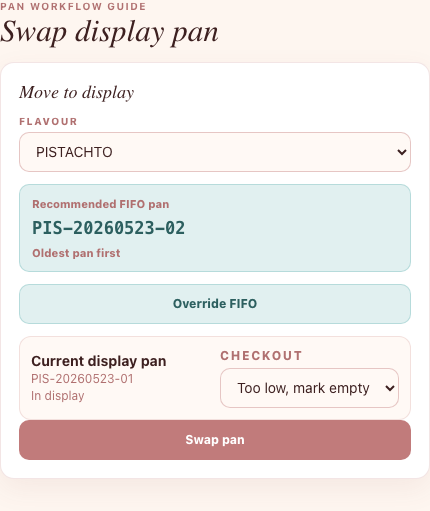
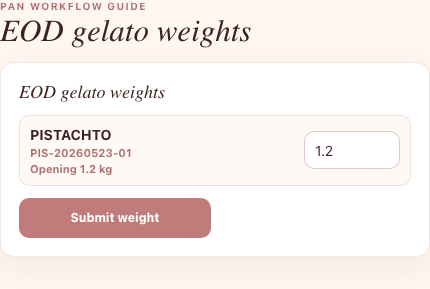
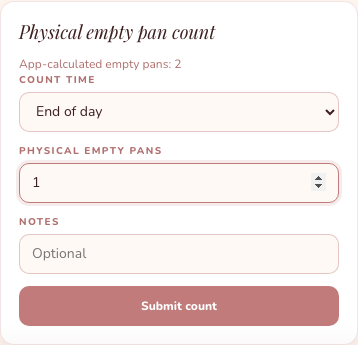
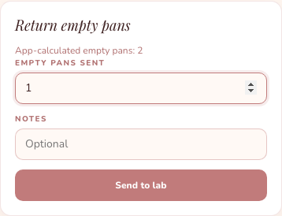

# Store Staff Pan Guide - Hinglish

Is guide ko store mein gelato pan ka kaam karte time use karo.

## 1. Pehle Check In Karo

1. **Store Staff** se sign in karo.
2. **Attendance** tap karo.
3. Apna store choose karo.
4. Selfie upload karo.
5. **Check in** tap karo.

Store pan ka kaam shuru karne se pehle check in hona zaroori hai.

## 2. Lab Se Pans Receive Karo

1. **Store** tap karo.
2. **Incoming pans** tap karo.
3. Store confirm karo.
4. Flavour ka naam check karo.
5. Us flavour ke neeche diye hue pan IDs check karo.
6. Sab pans sahi hain to **Accept all** tap karo.
7. Agar ek pan receive nahi hua, to sirf us pan ke liye **Missing** tap karo.
8. Agar ek pan galat ya damaged hai, to sirf us pan ke liye **Reject** tap karo.
9. Agar missing ya rejected pan baad mein mil jaye, to **Rejected pans** mein sirf us pan ko accept karo.

## 3. Pan Ko Display Mein Move Karo

1. **Store** tap karo.
2. **Move to display** tap karo.
3. Flavour choose karo.
4. **Recommended FIFO pan** check karo.
5. **Move pan** tap karo.

FIFO ka matlab hai sabse purana pan pehle use karna. App tumhare liye pan ID choose karta hai.

## 4. Jab Old Pan Bahut Low Ho To New Pan Nikalo

1. **Move to display** mein flavour choose karo.
2. **Recommended FIFO pan** check karo.
3. **Checkout** ke neeche **Too low, mark empty** choose karo.
4. **Swap pan** tap karo.

Old pan app mein empty count hoga.

## 5. Agar Manager Alag Pan Use Karne Ko Bole

1. **Store** tap karo.
2. **Move to display** tap karo.
3. Flavour choose karo.
4. **Override FIFO** tap karo.
5. Manager ne jo pan ID bola hai, woh choose karo.
6. Warning dhyan se padho.
7. **Move pan** ya **Swap pan** tap karo.

**Override FIFO** sirf tab use karo jab Store Manager bole.

## 6. Event/B2B Ke Liye Pan Store Se Bahar Bhejo

Ye sirf tab karo jab Store Manager ya Admin bole.

1. **Store** tap karo.
2. **Move outside store** tap karo.
3. Flavour choose karo.
4. Pan ID choose karo.
5. Destination **Event/B2B** hona chahiye.
6. Event ya B2B ka naam enter karo.
7. **Move pan out** tap karo.

Iske baad ye pan store FIFO mein use nahi hoga.

## 7. EOD Gelato Weight Enter Karo

1. **Store** tap karo.
2. **EOD gelato weights** tap karo.
3. App aaj display mein rahe har pan ko show karega.
4. Har pan ka weight kg mein enter karo.
5. **Submit weight** tap karo.

Agar pan empty hai, to **0** enter karo.
App jo **Opening** weight dikhata hai, usse zyada weight enter mat karo.

## 8. Physical Empty Pans Count Karo

Ye beginning of day ya end of day mein karo.

1. **Store** tap karo.
2. **Empty pan count** tap karo.
3. Store mein jitne empty pans dikh rahe hain, woh number enter karo.
4. **Submit count** tap karo.

Agar number app se match nahi hota, to app review ke liye flag karega.

## 9. Empty Pans Lab Ko Wapas Bhejo

1. **Store** tap karo.
2. **Return empties** tap karo.
3. Jitne empty pans lab ko bhej rahe ho, woh number enter karo.
4. **Send to lab** tap karo.

Sirf woh pans enter karo jo physically store se lab ja rahe hain.

## Yaad Rakho

- Manager na bole to hamesha recommended FIFO pan choose karo.
- **Incoming pans** mein agar sirf ek pan missing ya wrong hai, to poori dispatch reject mat karo.
- Agar pan mein bahut kam gelato hai, to **Too low, mark empty** use karo.
- Pan ko store ke bahar sirf Event/B2B ke liye bhejo, aur sirf manager/Admin ke bolne par.
- Weights **kg** mein enter karo, grams mein nahi.
- EOD par app jo har pan dikhata hai, uska weight enter karo.
- Agar kuch galat lag raha hai, to Store Manager ko batao.
